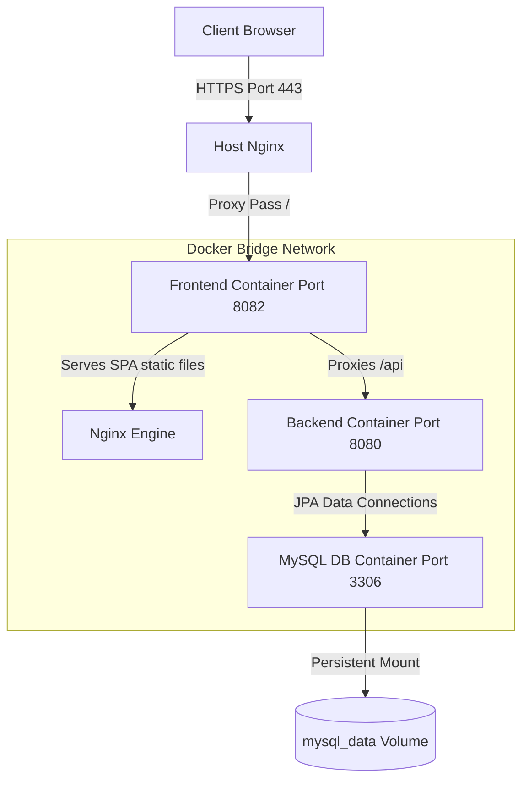

# DSA Tracker - Production Docker Deployment Guide

This guide details the deployment architecture, migration procedures, and management commands for the containerized **DSA Tracker** application on your AWS EC2 production instance.

---

## 🏗️ Deployment Architectures

### 1. Legacy Deployment (Non-Containerized)
In the legacy setup, services run natively on the host OS:
* **Frontend**: Compiled static assets served directly by the host Nginx instance from `/var/www/dsatracker`.
* **Backend**: Spring Boot executable JAR running as a background service via systemd (`dsatracker.service`) on port `8080`.
* **Database**: MySQL 8.0 running natively as a systemd service (`mysql.service`) on port `3306`.
* **SSL & Routing**: Host Nginx listens on ports `80`/`443`, terminates SSL via Certbot certificates, and proxies `/api` requests to `localhost:8080`.

```mermaid
graph TD
    Client[Client Browser] -->|HTTPS Port 443| HostNginx[Host Nginx]
    HostNginx -->|Serves Static Files| StaticAssets[/var/www/dsatracker]
    HostNginx -->|Proxy Pass /api| SpringBoot[Host Spring Boot Port 8080]
    SpringBoot -->|Connect| HostMySQL[Host MySQL Port 3306]
```

### 2. Containerized Deployment (Docker Compose)
In the containerized setup, the entire application stack runs inside isolated Docker containers, while the host Nginx handles secure public gateway routing:
* **Host Nginx**: Serves as the SSL gateway on port `443` (with Certbot) and acts as a high-performance reverse proxy routing all traffic for `api.deepcodev.com` to the frontend container on port `8082`.
* **`frontend` Container**: An Nginx container exposing port `8082`. It serves React static files and handles SPA history routing fallback natively. It has an internal proxy that forwards `/api` requests to the `backend` container over the isolated Docker bridge network.
* **`backend` Container**: A lightweight JRE runtime container running the Spring Boot application on port `8080`.
* **`db` Container**: A MySQL 8.0 container holding your persistent database volume (`mysql_data`), running on port `3306`.



---

## 🚀 Initial Migration & Setup Steps

Follow these exact steps to transition your AWS EC2 instance from the legacy setup to the containerized Docker deployment.

### Step 1: Backup & Dump the Production Database
Log into the EC2 instance and dump your active database to a SQL file to safeguard your data:
```bash
mysqldump -u app_user -pSecurePassword123! dsatracker > /home/ubuntu/dsatracker_prod_backup.sql
```

### Step 2: Stop and Disable Legacy Services
To free up ports (`8080`, `3306`) and resources, stop the native services and prevent them from starting up on server boot:
```bash
# Stop and disable Spring Boot JAR service
sudo systemctl stop dsatracker.service
sudo systemctl disable dsatracker.service

# Stop and disable Host MySQL service
sudo systemctl stop mysql
sudo systemctl disable mysql
```

### Step 3: Copy Workspace & Initialize Containers
Upload the new codebase zip containing the Docker configurations, extract it under `/home/ubuntu/dsatracker`, and build the containers:
```bash
# Navigate to the project directory
cd /home/ubuntu/dsatracker

# Start the Docker Compose stack (builds frontend/backend and spins up MySQL)
docker compose up --build -d
```

### Step 4: Import Production Data into the Docker MySQL Container
With the containers running, seed your production data backup directly into the new containerized database:
```bash
# Import the dumped database backup into the running db container
docker exec -i dsatracker-db mysql -u app_user -pSecurePassword123! dsatracker < /home/ubuntu/dsatracker_prod_backup.sql
```

### Step 5: Re-configure Host Nginx Routing
Update the host's Nginx configuration at `/etc/nginx/sites-available/deepcodev` to proxy all traffic to the new Docker gateway:

Run `sudo nano /etc/nginx/sites-available/deepcodev` and replace the first server block (`api.deepcodev.com`) with the following clean block:

```nginx
server {
    server_name api.deepcodev.com;

    # Proxy all traffic to the Nginx frontend container
    location / {
        proxy_pass http://localhost:8082;
        proxy_set_header Host $host;
        proxy_set_header X-Real-IP $remote_addr;
        proxy_set_header X-Forwarded-For $proxy_add_x_forwarded_for;
        proxy_set_header X-Forwarded-Proto $scheme;
    }

    listen 443 ssl; # managed by Certbot
    ssl_certificate /etc/letsencrypt/live/api.deepcodev.com/fullchain.pem; # managed by Certbot
    ssl_certificate_key /etc/letsencrypt/live/api.deepcodev.com/privkey.pem; # managed by Certbot
    include /etc/letsencrypt/options-ssl-nginx.conf; # managed by Certbot
    ssl_dhparam /etc/letsencrypt/ssl-dhparams.pem; # managed by Certbot
}
```

Test the configuration and reload Nginx:
```bash
sudo nginx -t
sudo systemctl reload nginx
```

---

## 🛠️ Build and Deployment Commands

Manage the application stack using these standard Docker Compose commands from `/home/ubuntu/dsatracker`:

| Command | Description |
| :--- | :--- |
| `docker compose up --build -d` | Build code assets, download dependencies, and boot all containers in background. |
| `docker compose down` | Safely stop and remove all active containers (data in MySQL remains safe). |
| `docker compose restart` | Restart all containers. |
| `docker compose logs -f` | Stream consolidated log outputs from all services. |
| `docker compose logs -f backend` | Stream logs only from the Spring Boot backend container. |
| `docker compose ps` | Check the health status and port mappings of the container cluster. |

---

## 🔄 Redeployment Process (Future Updates)

Every time you make code changes locally and want to push them to production, follow these **3 steps**:

---

### Step 1 — Package your changes (Windows PowerShell)

Run from `c:\Users\jayadeep\finalDSA\dsatracker`:

```powershell
# Clean up any previous archive
if (Test-Path dsatracker.zip) { Remove-Item dsatracker.zip -Force }
if (Test-Path temp_deploy) { Remove-Item temp_deploy -Recurse -Force }

# Stage clean source files (excludes node_modules, target, dist)
New-Item -ItemType Directory -Force -Path temp_deploy
Copy-Item -Path .env, docker-compose.yml, README.md -Destination temp_deploy/
New-Item -ItemType Directory -Force -Path temp_deploy/backend
Get-ChildItem -Path backend -Exclude target | Copy-Item -Destination temp_deploy/backend/ -Recurse -Force
New-Item -ItemType Directory -Force -Path temp_deploy/frontend
Get-ChildItem -Path frontend -Exclude node_modules, dist, .vite | Copy-Item -Destination temp_deploy/frontend/ -Recurse -Force

# Compress and clean up staging folder
Compress-Archive -Path temp_deploy/* -DestinationPath dsatracker.zip -Force
Remove-Item temp_deploy -Recurse -Force
```

---

### Step 2 — Upload to the EC2 server (Windows PowerShell)

```powershell
scp -i backend.pem dsatracker.zip ubuntu@ec2-13-48-212-110.eu-north-1.compute.amazonaws.com:/home/ubuntu/
```

---

### Step 3 — Extract & rebuild containers (SSH into the server)

```bash
ssh -i backend.pem ubuntu@ec2-13-48-212-110.eu-north-1.compute.amazonaws.com
```

Then on the server:

```bash
# Fix permissions (required after Windows zip uploads)
sudo chown -R ubuntu:ubuntu /home/ubuntu/dsatracker
find /home/ubuntu/dsatracker -type d -exec chmod 755 {} \;
find /home/ubuntu/dsatracker -type f -exec chmod 644 {} \;

# Extract updated files
unzip -o /home/ubuntu/dsatracker.zip -d /home/ubuntu/dsatracker/

# Rebuild and restart only changed containers
cd /home/ubuntu/dsatracker
docker compose up --build -d
```

> **Note**: Docker rebuilds only the layers that changed (e.g. just the backend if you only touched Java files). Your MySQL data volume (`dsatracker_mysql_data`) is **never touched** during redeployment.

---

## 🩹 Troubleshooting & Common Issues

### 1. Database Connection Failures
* **Symptom**: Backend container log displays `Connection refused` or `Communications link failure`.
* **Fix**: Ensure the database health check passes. Run `docker compose ps` to verify that `dsatracker-db` is marked as `healthy`. If it is starting up, wait a few seconds and run `docker compose restart backend`.

### 2. Host Port Conflicts
* **Symptom**: Docker compose up throws `bind: address already in use` error for port `8080` or `3306`.
* **Fix**: The legacy host services are still running. Execute `sudo systemctl stop dsatracker` and `sudo systemctl stop mysql` to release the ports.

### 3. Container Auto-Start on Boot
* **Detail**: All containers are configured with `restart: always` in the `docker-compose.yml` file. This guarantees that if the AWS EC2 server reboot occurs, the Docker daemon will automatically initialize and run the containers without manual user intervention.
